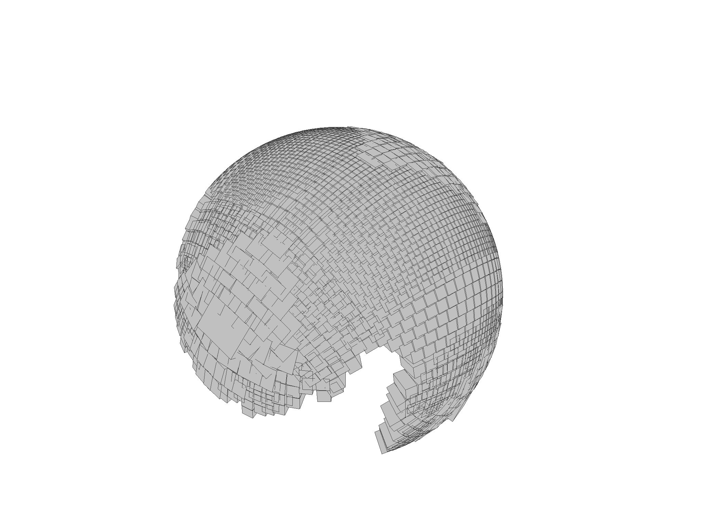

# Variety Approximations

Certified variety approximation builds a finite collection of interval boxes
covering part of a real algebraic variety. Each accepted box is certified by
local interval/Krawczyk checks, so the output can be used as a rigorous local
paving rather than just a sampled mesh. The implementation is informed by
certified curve projection and surface approximation methods from
[burr2025certified](@cite) and [burr2026certified](@cite).

```@setup varieties_api_example
using CertifiedHomotopyTracking
```

```@repl varieties_api_example
CC = AcbField(128);
@variables x y z;
surface = variety_system([x^2 + y^2 + z^2 - 1], [x, y, z]; CCRing=CC);
p_surface = [CC(1), CC(0), CC(0)];

evaluate_system(surface, p_surface)
jacobian_system(surface, p_surface)
surface_approx = certified_variety_approximation(surface, p_surface; tangent_radius=1e-3, normal_radius=1e-3, max_boxes=3);
length(surface_approx.boxes)
```

```@docs
variety_system
AlgebraicVarietySystem
VarietyBox
VarietyApproximation
system
evaluate_system
jacobian_system
certified_variety_approximation
export_variety_obj
```

## OBJ Export Example

Build a larger surface approximation and export the certified boxes as a
Wavefront OBJ file.

```julia
CC = AcbField(128);
@variables x y z;

surface = variety_system([x^2 + y^2 + z^2 - 1], [x, y, z]; CCRing=CC);

p_surface = [CC(1), CC(0), CC(0)];

surface_approx = certified_variety_approximation(
    surface,
    p_surface;
    tangent_radius=1e-3,
    normal_radius=1e-3,
    max_boxes=3000,
    threading=true,
    ntasks=6,
);

export_variety_obj(surface_approx, "sphere_boxes.obj")
```



## References

```@bibliography
Pages = [@__FILE__]
```
