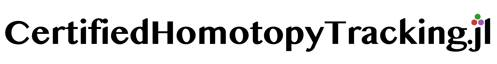

[](https://klee669.github.io/CertifiedHomotopyTracking.jl/dev/)

**CertifiedHomotopyTracking.jl** provides interval-certified tools for tracking
polynomial homotopy paths, certifying numerical traces a posteriori, exploring
monodromy graphs, and building certified local approximations of algebraic
varieties. It uses ACB/Arb interval arithmetic through
[Nemo.jl](https://github.com/Nemocas/Nemo.jl), and integrates with
[HomotopyContinuation.jl](https://www.juliahomotopycontinuation.org/) and
[GAP](https://www.gap-system.org/) where those tools are useful.


## Table of Contents
* [Features](#features)
* [Quick Start](#quick-start)
  * [1. Basic certified tracking](#1-basic-certified-tracking)
  * [2. Certified monodromy group computation](#2-certified-monodromy-group-computation)


## Features

* **Certified tracking:** Uses interval arithmetic and the Krawczyk test to certify solution paths.
* **A posteriori certification:** Certifies numerical HomotopyContinuation.jl traces using CHT interval checks.
* **Certified monodromy computation:** Automatically tracks the complete homotopy graph to generate the monodromy group (`solve_monodromy`).


## Quick Start

### 1. Basic certified tracking

If you want to track a single solution path from $t=0$ to $t=1$:

```julia
using CertifiedHomotopyTracking

# 1. Set up the variables and field.
@variables x y
PREC_BITS = 256
CC = AcbField(PREC_BITS)

# 2. Define your target system F(x, y) and start system G(x, y).
f1 = x^2 + 3*y - 4
f2 = y^2 + 3

F = [f1, f2]
G = [x^2 - 1, y^2 - 1]

# 3. Define the start point at t = 0 and the homotopy H.
H = straight_line_homotopy(F, G, [x, y]; CCRing=CC, gamma=CC(0.5, 0.5))
point = [CC(1), CC(-1)]

# 4. Certified tracking.
res = track_path(H, point)
success(res)
solution(res) # rounded ComplexF64 solution for display
max_norm(hcat(evaluate_H(H, certified_region(res), CC(1)))) # certified residual check

# 5. A posteriori certification of a numerical HC.jl trace.
cert = certify_posteriori(
    H,
    point;
    max_step_size = Inf,
    max_depth = 6,
    certification_chart = :auto,
)
success(cert)
solution(cert)
cert.total_boxes
```

`track_path` uses adaptive precision by default. It starts at 53 bits, retries
with higher precision when certified refinement fails or Krawczyk validation
stagnates. To compare with the
previous fixed-precision behavior, use:

```julia
fixed_res = track_path(H, point; adaptive_precision=false)
```


### 2. Certified monodromy group computation

To compute the monodromy group of a parameterized system:

```julia
using CertifiedHomotopyTracking

# 1. Set up the variables and field.
@variables x y
@variables p q
PREC_BITS = 256
CC = AcbField(PREC_BITS)

# 2. Define your parameter system F(x, y; p, q).
f1 = p*x^2 + 3*y - 4
f2 = y^2 + q
F_exprs = [
    f1, f2
]

x_vars = [x, y]
p_vars = [p, q]

# 3. Set up the initial seed.
bp = [CC(1), CC(-1)] # values of p and q
x0 = [CC(1), CC(1)] # a solution at (p, q) = bp


# 4. Set up a homotopy graph.
v1 = vertex(bp, [x0])
vertices = [v1]

for i in 1:3
    rand_u = [CC(cis(rand() * 2pi)) for _ in 1:2]
    push!(vertices, vertex(rand_u))
end

compiled_homotopy = compile_edge_homotopy(F_exprs, x_vars, p_vars)

# 5. Solve monodromy using certified tracking and a posteriori certification.
result = solve_monodromy(
    compiled_homotopy,
    vertices;
    max_roots = 4,
    posteriori = true,
    posteriori_options = (;
        max_depth = 6,
        certification_chart = :auto,
    ),
)

# Fixed-precision comparison:
# result = solve_monodromy(compiled_homotopy, vertices;
#     max_roots=4, track_options=(; adaptive_precision=false))

# 6. GAP analysis.
G = build_gap_group(4, result) # Find a group of size 4 from edge correspondences

if G !== nothing
    println("Structure Description:")
    println(GAP.Globals.StructureDescription(G)) # C2 x C2
    println("Galois Width:")
    gw = galois_width(G)
    println(gw) # 2
end
```

## Usage of AI

AI coding assistants were used during parts of the development process for
implementation support, refactoring, and documentation drafting. All code changes
are reviewed by a human maintainer, and the package documentation is written and
curated by humans.
